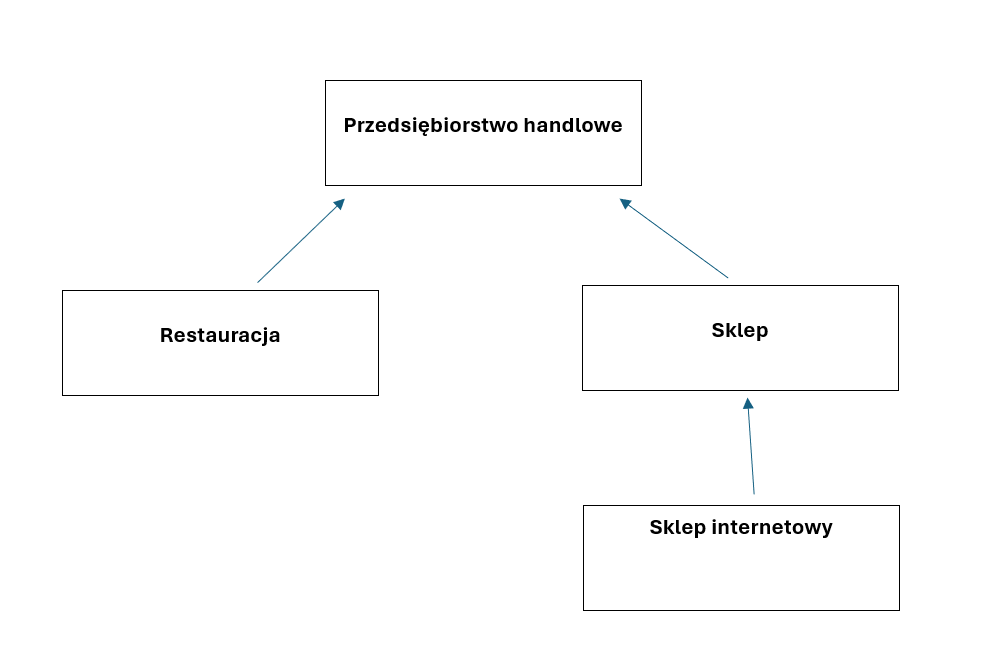

# Object-Oriented Programming in C++
The repository contains my mini project that I created as part of learning the C++ object-oriented programming paradigm at the university at the beginning of my adventure with programming. The project uses the standard C++ library and the included .cpp and .h files.

The project includes an implementation of the inheritance scheme given below.

Moreover, it has been prepared a generic Container class for storing objects of any type, implemented as the doubly linked list.

For all created classes a few operators have been overloaded. Each class has also implemented persistance methods for storing and reconstructing the state of the entire object.

The app contains console interfaces for testing functionalities of each class.
